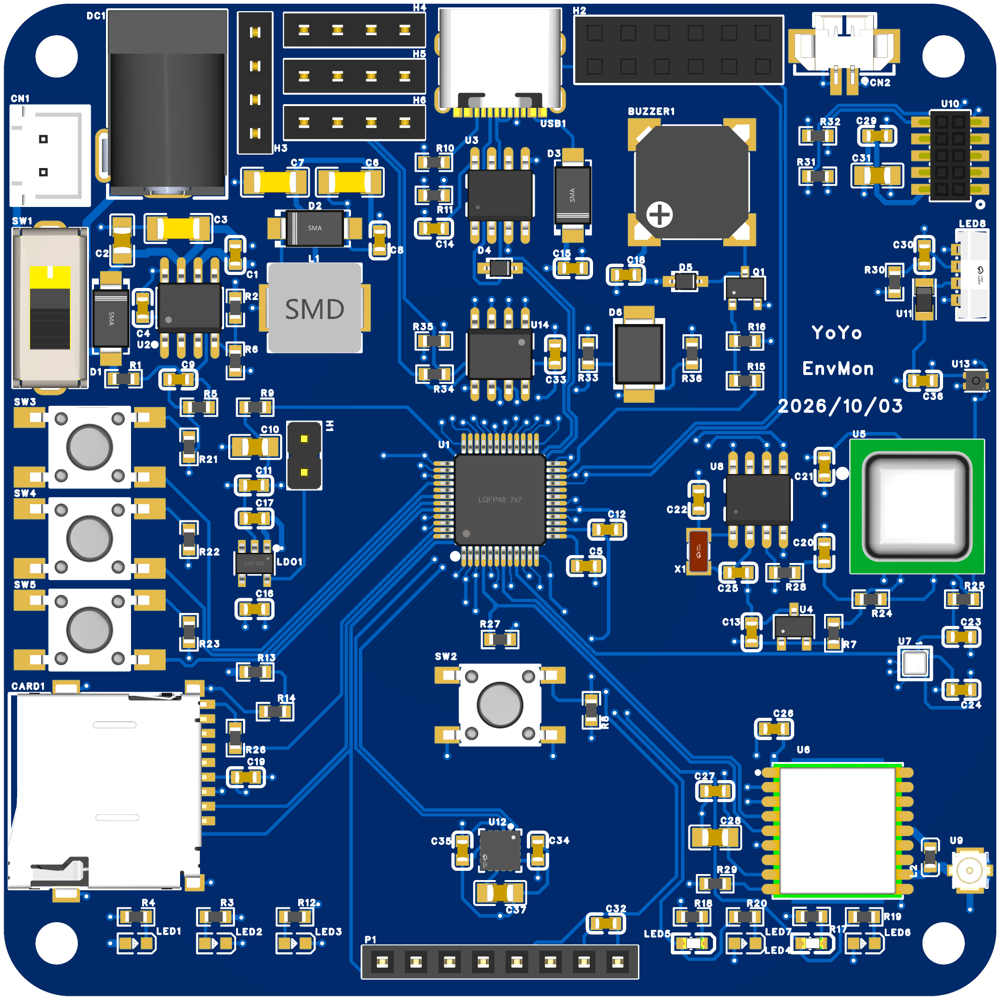
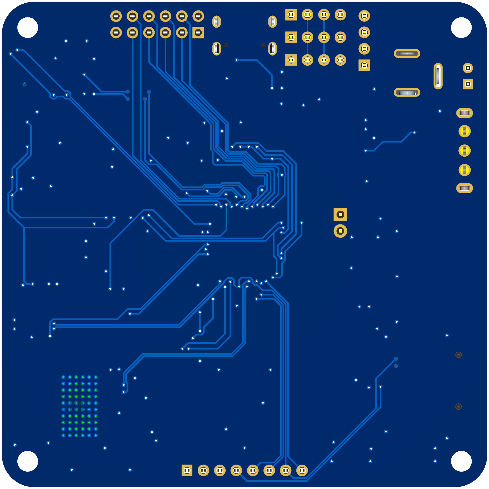
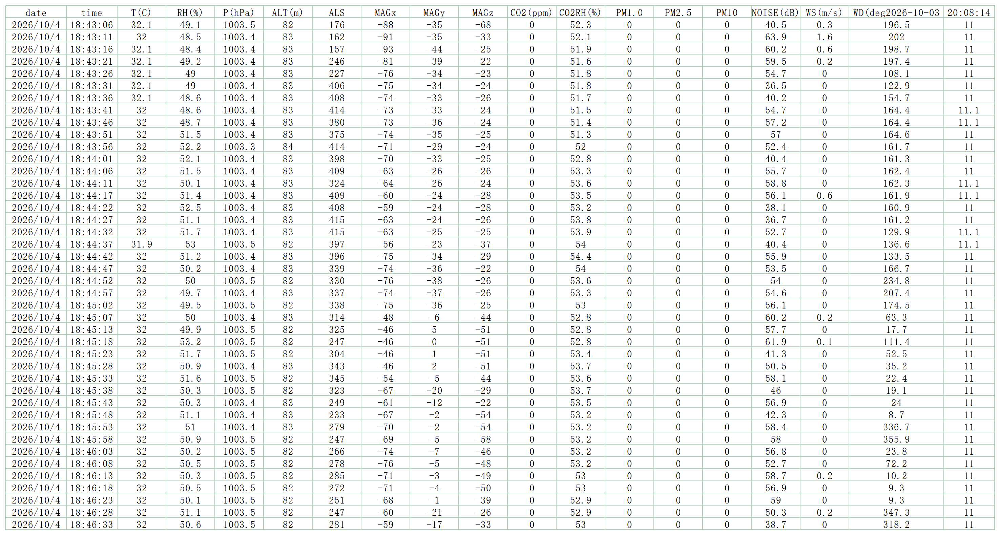
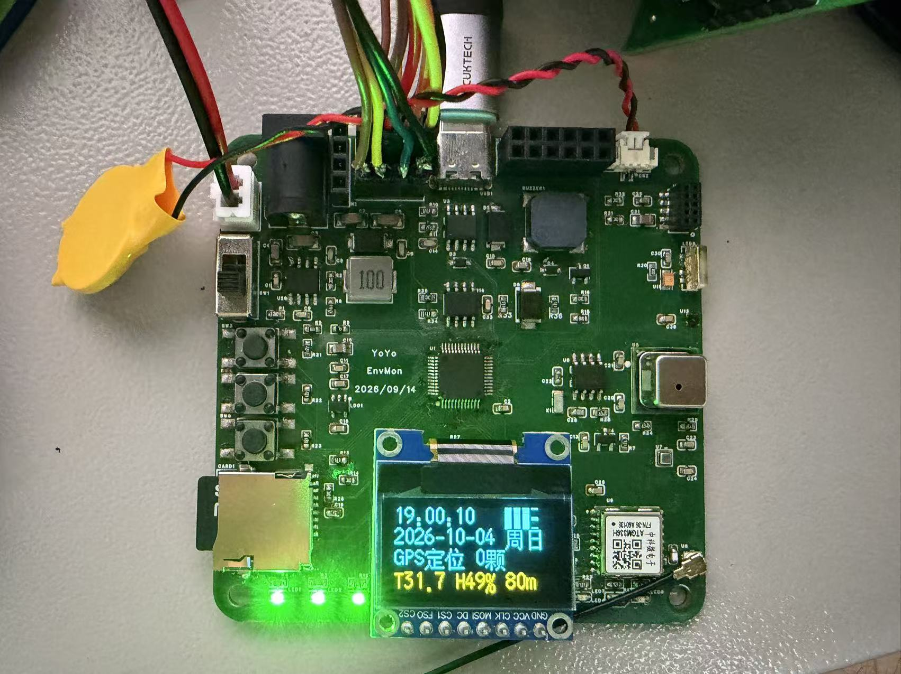
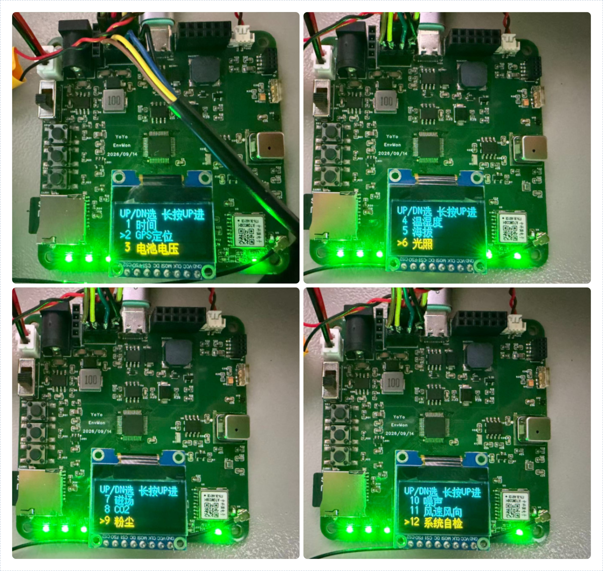
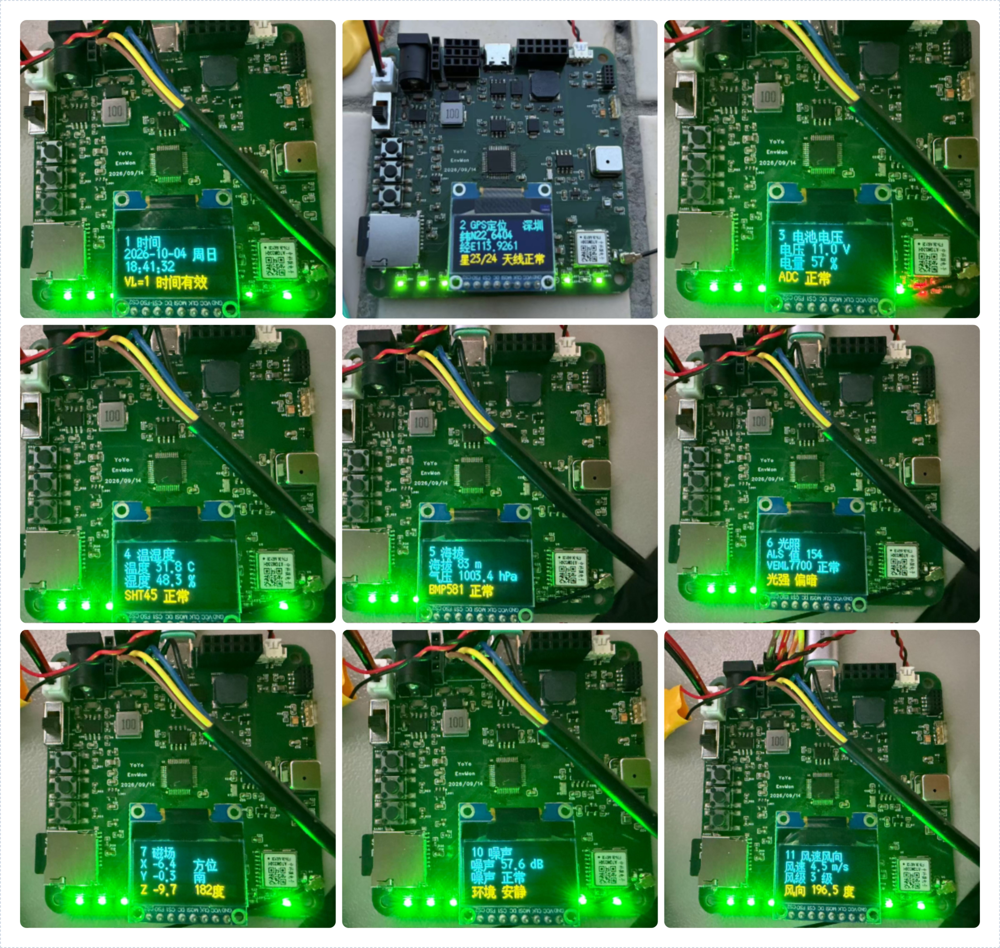
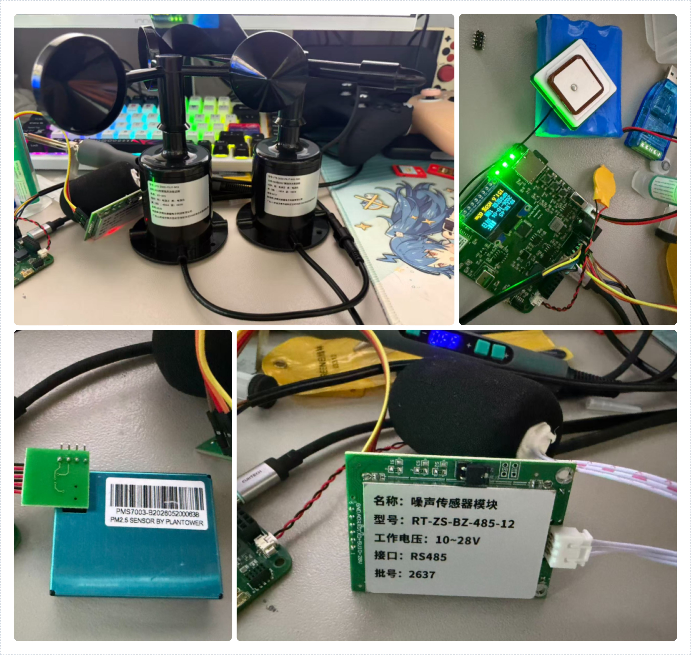

# YoYo 环境简要素质检测仪

## 项目简介

环境简要素质检测仪是一款基于 STC8H8K64U（8051 内核）的便携式多参数环境监测仪。75×75 mm 四层板，把温湿度、气压/海拔、光照、磁场方位、CO₂、颗粒物、噪声、风速风向的测量，连同 GPS/北斗定位授时、TF 卡数据记录、OLED 本地显示与按键交互，全部集成在一块板上；外部传感器通过 RS485 总线接入。

图1 系统框图：以 STC8H8K64U 为核心。左侧 IO/ADC/I²C：电源与状态 LED、按键、电池采样、指南针/温湿度/CO₂/光照/时钟；右侧 PWM/SPI/UART/RS485：蜂鸣器、气压海拔、MicroSD、OLED、定位授时、颗粒物、以及 RS485 的噪声/风速/风向。

## 项目功能

* 环境测量：温度、湿度、气压/海拔、环境光、磁场方位（指南针）、CO₂、颗粒物 PM1.0/2.5/10
* 噪声与风：RS485 总线接入 噪声 + 风速 + 风向（Modbus-RTU）
* 定位授时：GPS/北斗定位，并自动校准板载 RTC
* 数据记录：TF 卡按 CSV 记录全部通道
* 本地交互：128×64 OLED 多页菜单 + 3 按键 + 蜂鸣器 + 多路状态灯
* 供电：3S 锂电（标称 11.1 V / 满电 12.6 V）或 12 V 适配器，USB 5 V 并入

## 项目参数

* 主控：STC8H8K64U-45I-LQFP48（8051 1T，64 KB Flash / 8 KB xdata），调试下载经 CH340N
* 温湿度 SHT45（I²C）；气压/海拔 BMP581（SPI）；环境光 VEML7700（I²C）
* 磁场方位 IST8310 三轴磁力计（I²C）；CO₂ SCD41（I²C，NDIR/光声）
* 颗粒物 PMS7003（UART3，9600）
* 噪声/风速/风向：RS485 Modbus 从机（9600-8N1，地址 1/2/3）
* 定位授时：ATGM336H GNSS（UART2，115200）+ 有源天线；GPS 自动授时 PCF8563 RTC（I²C + 32.768 kHz），GNSS 模块带备电（CN2）
* 存储 MicroSD（SPI，FatFs）；显示 SSD1306 128×64（SPI）+ GT20L16S1Y 中文字库
* 电源：12V →（RT8289 降压）5V →（ME6211 LDO）3.3V；SS54 防反灌；USB 5V 经肖特基并入；ADC 基准 CJ431 2.5V
* 下载：H1 跳线断 3.3V 冷启动，STC-ISP 串口下载

## 原理图与硬件设计

图2 最小系统：主控去耦、复位电路、下载口（USB 转串口）、ADC 基准、RT8289 降压 + ME6211 LDO、3.3V 断电跳线 H1。

图3 IO：按键、TF 卡与 GPS 状态 LED、蜂鸣器驱动、电池采样分压、扩展排针。

图4 通信：I²C 五传感器共用总线；SPI 共享（BMP581 / TF / OLED / 字库，四路独立 CS）；UART 接 GNSS 与 PMS7003；RS485 用 MAX3485，含 120Ω 终端与失效偏置，DE/RE 由 P2.6 控制。

图5 PCB：75×75 mm 四层板，按模块分区布线，四角固定孔。

图6 3D 渲染图。

## 软件与代码

Keil C51（uVision）工程，纯 C，模块化分层：APP/（页面状态机）+ BSP/（每个外设一个 bsp_*.c）+ MCU/（配置、类型、中断）。源码为 GBK 编码，注释含寄存器位、手册页码与设计取舍。完整工程见附件 / GitHub。

> 说明：驱动与业务逻辑的编写过程使用了 opencode + DeepSeek 辅助。

## 亮点

* 在 8051 平台上把十余种传感器 + GNSS + RS485 + TF + OLED 全部跑通，功能完整、可复刻
* 规范电源树：12V→5V→3.3V 三级；SS54 防反灌；3.3V 断电跳线专为冷启动下载
* 连续数据流（NMEA / PM 颗粒物）用「接收中断 + 环形缓冲」可靠组帧，不丢帧
* GPS 自动授时校准 RTC（含闰年、跨日、UTC+8 处理）
* RS485 作 Modbus 主机，统一三个从机地址/波特率，实测全通
* 分层清晰、注释详尽（寄存器位 / 手册页码 / 设计取舍）；OLED 中文字库 + 三态状态灯

## 踩坑与经验

* RS485 地址撞车：噪声/风速/风向出厂默认都是地址 1，同挂一条总线会同时应答、主站收到撞帧乱码 —— 必须先改成 噪声1 / 风速2 / 风向3（改地址写 0x07D0；改波特率写 0x07D1，风速/风向手册没写，实测同厂支持）。
* TF 卡 f_mount 返回 0x0D：根因是 SPI 收发缓冲 sd_rb[8] 读 16 字节 CSD 时越界，覆盖了全局变量 —— 扩到 [16] 即好。
* SDSC 与 SDHC 寻址不同：≤2 GB 用字节地址（先 CMD16 设块长 512），≥4 GB 用块地址。
* ADC 单次采样噪声大（散布 ±180 LSB），软件 16 次平均后稳定；下一版给基准 CJ431 多加去耦。
* I²C 传感器上电状态：IST8310 需先触发单次测量、VEML7700 上电默认关断。
* OLED 换行回卷：一行放不下再从列 ≥120 起画 16 宽汉字，页模式列地址 128→0 会覆盖行首，画前先判断。
* Keil C51 两个坑：① 无 BOM 的 GBK 源码若含 0xFD 字节，字符串会被吃掉一个字节，用 \xCA\xFD 转义；② const 数组默认进 DATA，必须写 static const unsigned char code。

## 组装与使用注意

* SCD41 顶面 PTFE 保护膜不可撕（撕了报废）
* 12V 输入注意极性；TF 卡注意方向
* GPS 有源天线 IPEX 座要接触牢固（弱信号影响定位）
* RS485：注意 A/B 极性、与主机共地；三个从机地址/波特率已统一
* 下载：拔 H1 跳线帽断电 → STC-ISP 点下载 → 插回
* 首次上电按菜单逐项自检

## 实测成果

图7 上电运行后 TF 卡按 CSV 记录的全通道数据（温度/湿度/气压/海拔/光照/磁场/CO₂/颗粒物/噪声/风速/风向）。注：CO₂=0（SCD41 顶面 PTFE 膜被误当防尘膜撕除、不可逆失效；已备新模块，择期更换）、PM=0（PMS7003 未接 —— 排线不好买，新做了一个转接板，在等贴片排针到货）。

## 实物与展示

图8 实物上电运行，OLED 显示时间、日期、GPS 状态、温度/湿度/海拔。

图9 OLED 菜单总览（0 菜单 / 1 时间 / 2 GPS 定位 / … / 12 系统自检）。

图10 各显示子页（9 个具体页面的实物拼图：时间 / 温湿度 / 电池电压 / 海拔 / 光照 / 磁场 / 噪声 / 风向 …）。

图11 外接的 RS485 风速/风向/噪声传感器、GNSS 天线与 PMS7003 颗粒物模块。

## 相关链接

* **立创开源硬件平台**：https://oshwhub.com/eda_ffzehxde/project_uhlshozy
* **GitHub 仓库**：https://github.com/AugetyYoYo/YoYo-Environmental-Monitor
* **联系邮箱**：AugetyYoYo@gmail.com

---

## 说明

* 固件源码为 GBK 编码；注释中涉及寄存器位、手册页码与设计取舍。
* 本项目为个人学习/自用项目，硬件/固件均按"先跑通、可维护"的目标组织，欢迎参考复刻。
