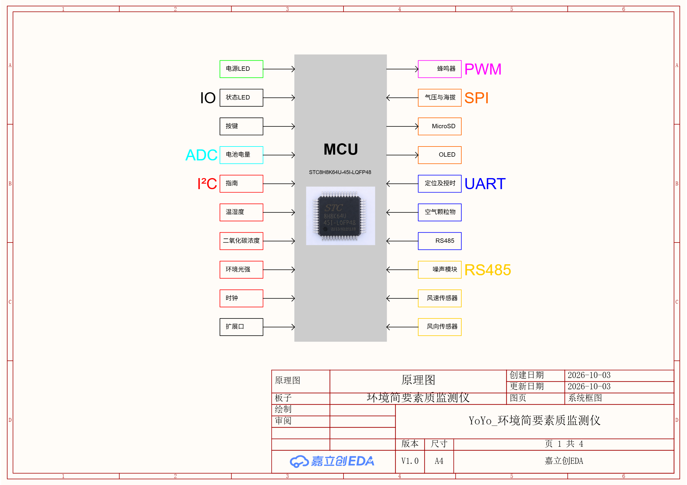
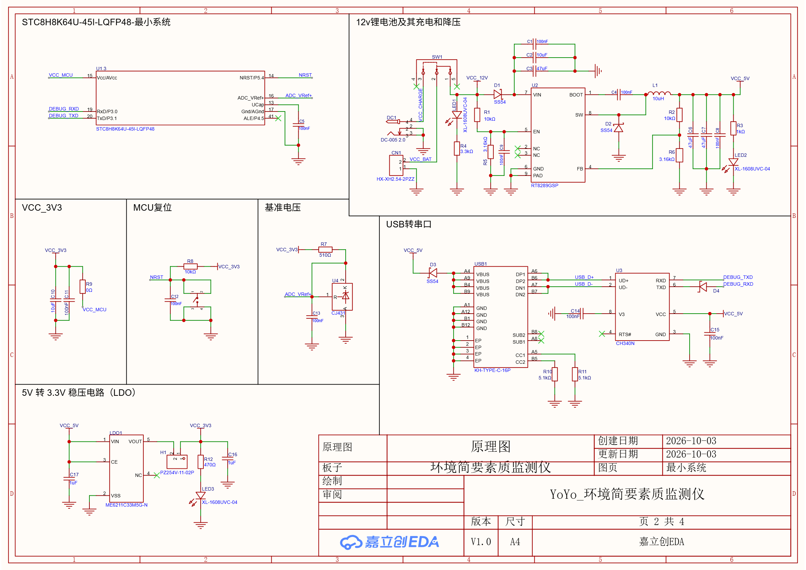
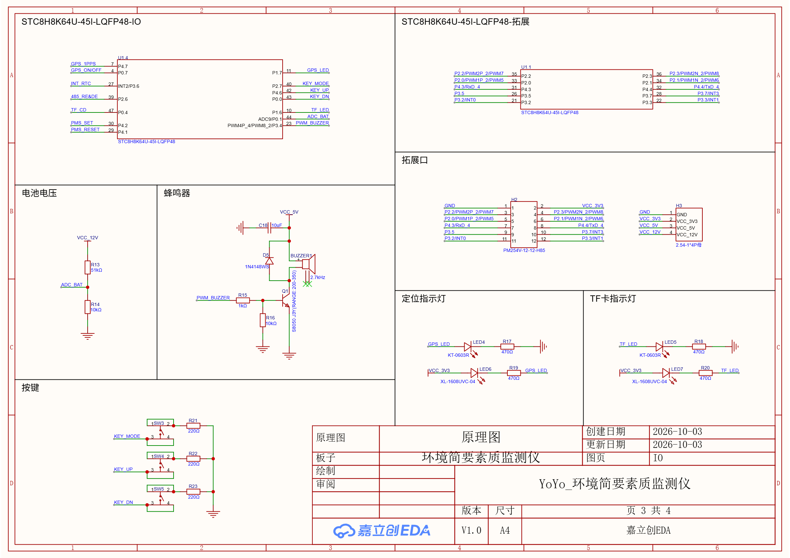
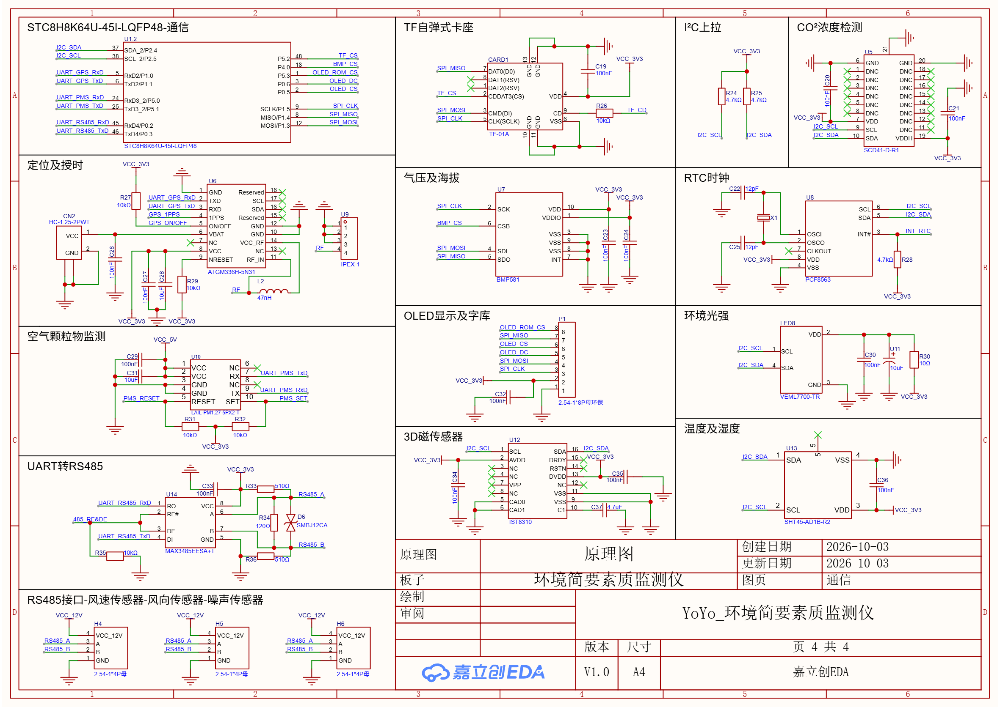
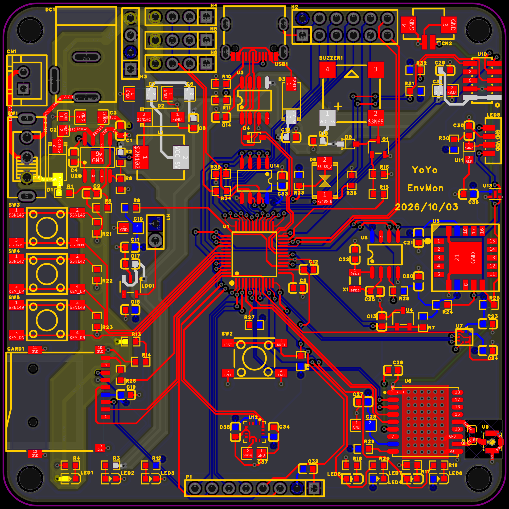
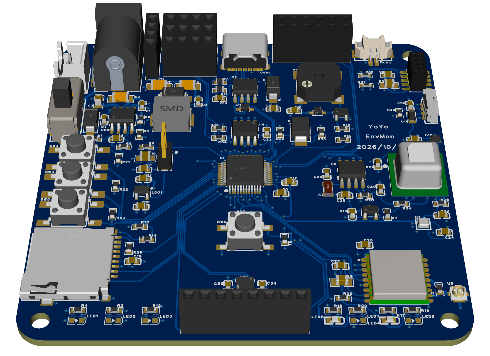

# 硬件（hardware）

本项目的原理图 / PCB 源文件为 **嘉立创EDA 专业版** 工程，已在 **立创开源硬件平台** 开源：

- 工程名：`YoYo_环境简要素质监测仪`
- 立创开源：https://oshwhub.com/eda_ffzehxde/project_uhlshozy

## 预览

| 系统框图 | 最小系统 |
|---|---|
|  |  |

| IO | 通信 |
|---|---|
|  |  |

| PCB 布局 | 3D 渲染 |
|---|---|
|  |  |

## 板卡概览

- 尺寸：**75 × 75 mm 四层板**，四角各一个 1.6 mm 半径固定孔。
- 原理图分页（共 4 页）：
  1. 系统框图
  2. 最小系统
  3. IO
  4. 通信

> 硬件接口信息（电源树、主控引脚分配、各总线与外设寄存器、连接器定义）见
> `../docs/YoYo_环境简要素质检测仪_设计说明.md`，那是软件联调的依据；
> 调试踩过的坑见 `../docs/YoYo_环境简要素质检测仪_踩坑记录.md`。

## 关键设计点（摘要）

- **电源**：12 V →（RT8289 降压）5 V →（ME6211 LDO）3.3 V；USB 5 V 经肖特基并入；SW1 电源切换。
- **D1(SS54)**：12 V 轨防反灌（阻断降压芯片体二极管从 5 V 反灌）。
- **H1(2P) 跳线**：3.3 V 断电点，用于 STC-ISP 冷启动下载。
- **共享 SPI 总线**：BMP581 / TF / OLED / 字库，四路独立 CS。
- **RS485**：MAX3485（U14）+ 120 Ω 终端 + 失效偏置，DE/RE 由 P2.6 控制。
- **ADC**：CJ431 2.5 V 基准；分压采电池。

## 目录内容

- `YoYo_环境简要素质监测仪.epro2`：嘉立创EDA 专业版**工程源文件**（可直接打开）
- `schematic/`：原理图 4 页（系统框图 / 最小系统 / IO / 通信）
- `pcb/`：PCB 布局图 + 3D 渲染图
- `photos/`：实物图、上电自检九宫格、TF 卡记录截图
- `gerber/`：嘉立创EDA 导出的 Gerber / 钻孔 / 飞针测试文件（可直接打样）

## 已知问题 / 待改进

- **SCD41**：CO₂ 模块损坏（读数恒为 0），待更换。
- **PMS7003**：排母 U10 引脚须按 `1/2=VCC、3/4=GND、5=RESET、7=RX、9=TX、10=SET` 焊接
  （原排法会 5 V 对地短路 + 模块被复位）。
- MISO(P1.4) 缺上拉；ADC 基准去耦偏弱（详见踩坑记录）。
